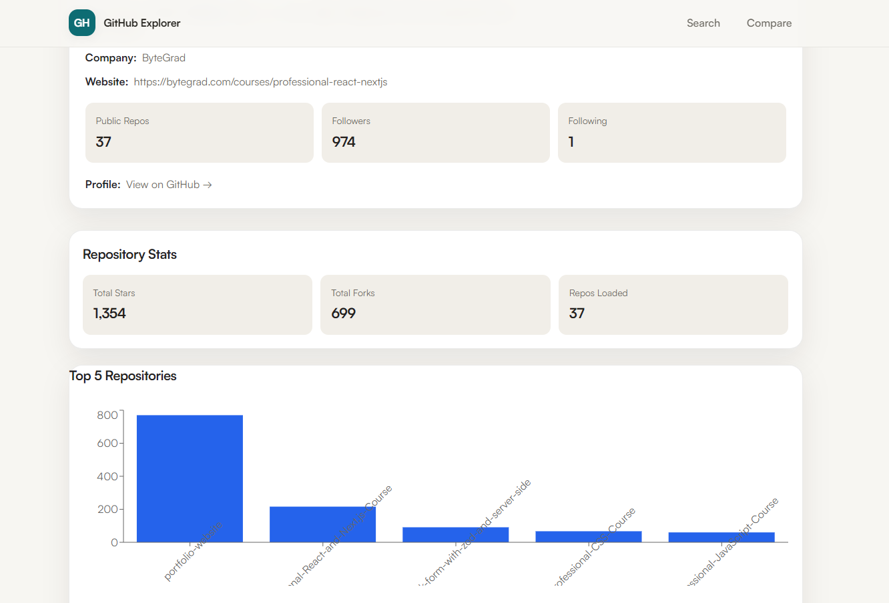

# Himani Agrawal - Developer Portfolio



A modern, responsive, and beautifully crafted developer portfolio built to showcase my full-stack and frontend engineering projects. The design features a premium "glassmorphic" aesthetic with a deep dark-mode color palette and dynamic micro-animations.

[**View Live Site**](https://him-agni.github.io/portfolio/)

---

## ✨ Features

- **Glassmorphism UI**: Stunning translucent backgrounds with blurred overlays (`backdrop-filter`) creates a rich depth-of-field effect.
- **Dynamic Projects Showcase**: High-quality UI mockups with interactive 3D-hover states linking to live demos and source code.
- **Responsive Design**: Flawlessly adapts to all screen sizes from mobile to desktop.
- **Seamless Navigation**: Sticky navbar with smooth scroll integration to page sections.
- **Optimized for Speed**: Built on Vite for lightning-fast HMR and highly optimized production builds.

## 🛠️ Tech Stack

- **Framework:** React 18
- **Build Tool:** Vite
- **Styling:** Vanilla CSS (Custom Properties, Flexbox, CSS Grid)
- **Icons:** `lucide-react` & `react-icons`
- **Deployment:** GitHub Pages

## 🚀 Local Development

To run this project locally, follow these steps:

**1. Clone the repository**
```bash
git clone https://github.com/him-agni/portfolio.git
cd portfolio
```

**2. Install dependencies**
```bash
npm install
```

**3. Start the development server**
```bash
npm run dev
```

**4. Open your browser**
Navigate to `http://localhost:5173/`

## 📦 Deployment

This project configured to deploy automatically to GitHub pages. To deploy a new update:

1. Commit your changes to the `main` branch.
2. Run the deployment script:
   ```bash
   npm run deploy
   ```
This will automatically build the `dist` directory and push it to the `gh-pages` branch.

## 🤝 Connect with Me

- **LinkedIn:** [linkedin.com/in/himani--agrawal](https://www.linkedin.com/in/himani--agrawal/)
- **GitHub:** [github.com/him-agni](https://github.com/him-agni)

---

*Designed & developed by [Himani Agrawal](https://github.com/him-agni).*
